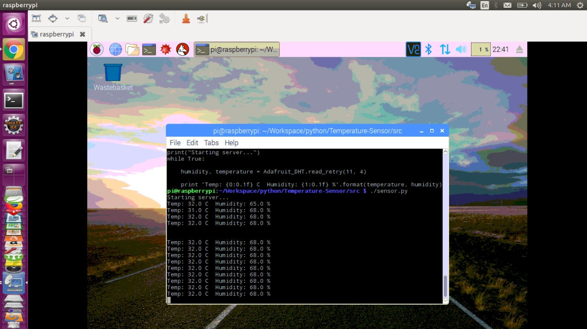

# pi-screen

This project is about connecting temperature and humidity sensor to respberry.

 Here I am using **DHT11 Digital Temperature Humidity Sensor Module**  to connect to respberry-pi 3 to display the temperature and humidity readings.

